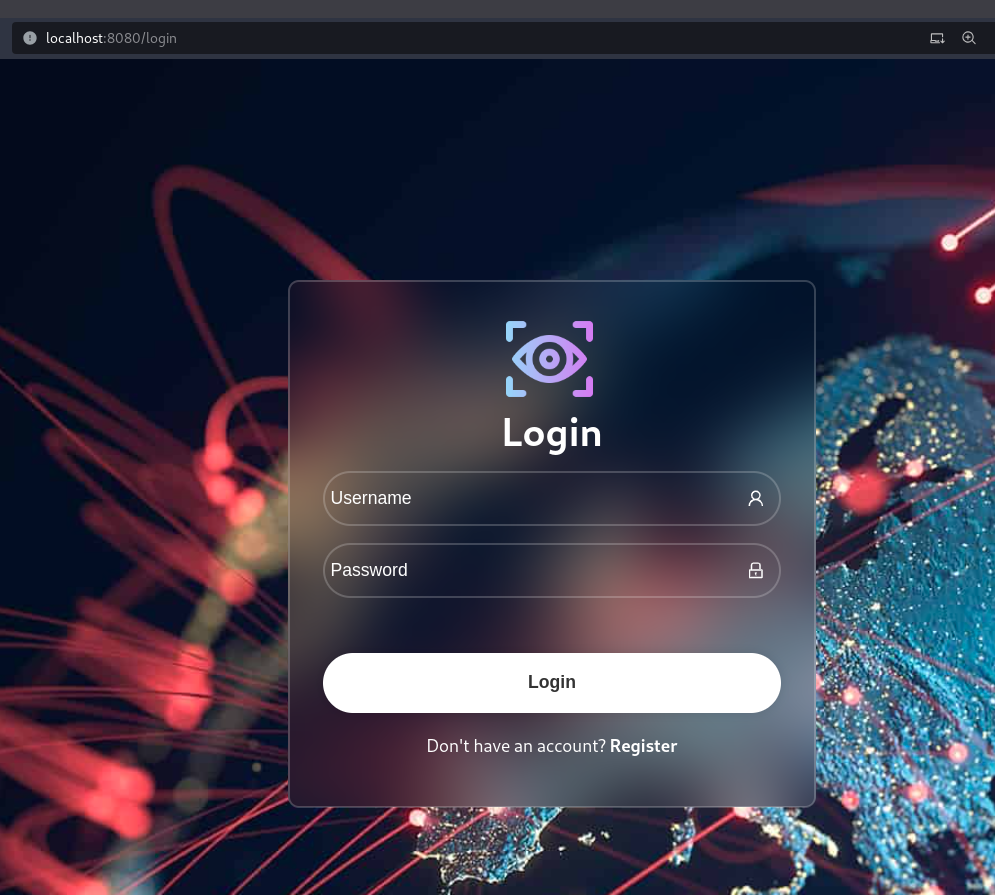
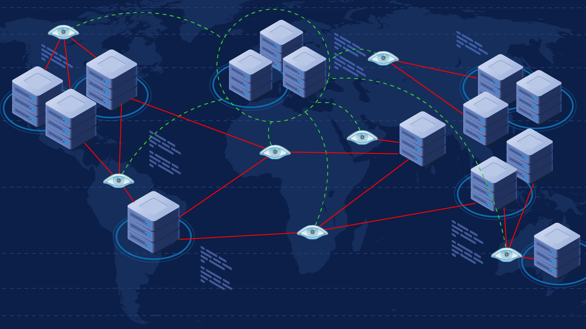
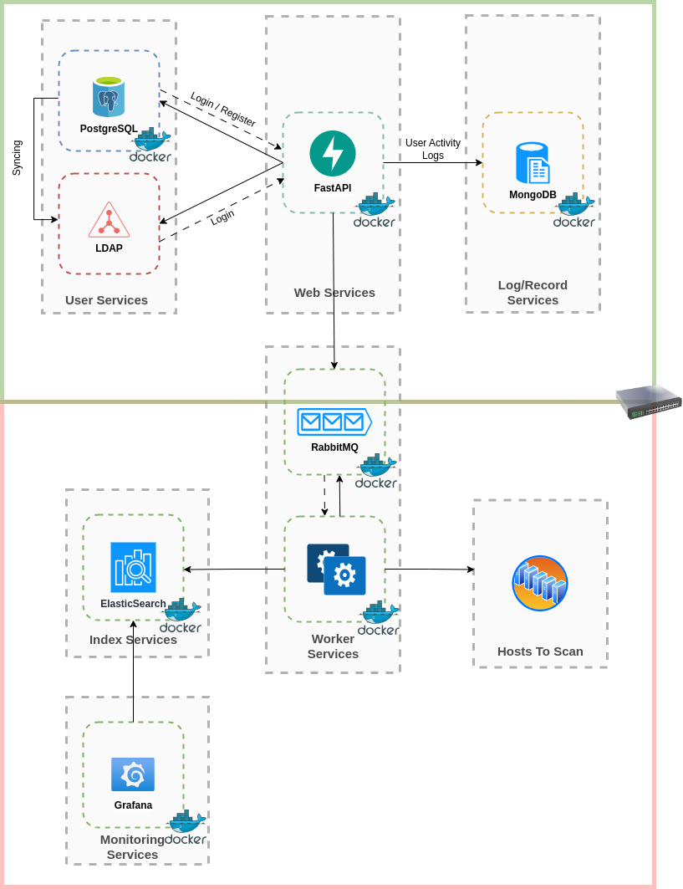
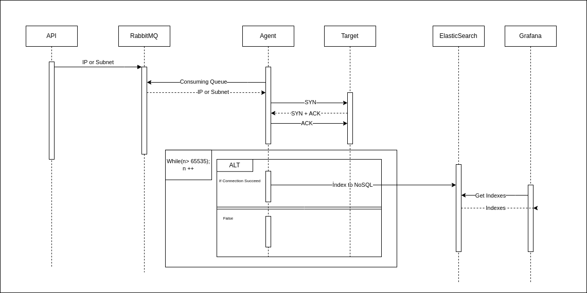

<h1 align="center">Port Pilot</h1>

<p align="center">
  <a href="https://github.com/capitansec/PortPilot/network"></a>
  <a href="https://github.com/capitansec/PortPilot/stargazers"></a>
  <a href="https://github.com/capitansec/PortPilot/issues"></a>
  <a href="https://github.com/capitansec/PortPilot/blob/master/LICENSE.md"></a>
  <a href="https://discord.com/users/capitan8674"></a>
 <p align="center">
  <a href="http://www.python.org/download/"></a>
  <a href="https://fastapi.tiangolo.com/"></a>
  <a href="https://www.elastic.co/downloads/elasticsearch"></a>
  <a href="https://www.mongodb.com/try/download/community"></a>
  <a href="https://www.rabbitmq.com/download.html"></a>
  <a href="https://grafana.com/grafana/download"></a>
  <a href="https://www.postgresql.org/download/"></a>
  <a href="https://www.postgresql.org/download/"></a>
  <a href="https://reactjs.org/" rel="nofollow"></a>

<p>
PortPilot is a cutting-edge port scanning tool designed specifically for offensive security disciplines such as bug bounty hunting and penetration testing. Its unique distributed architecture allows scalable agents to be deployed globally, providing unparalleled scanning capabilities.
Getting started with PortPilot is as easy as installing the agent and entering the RabbitMQ connection information. The newly added agent is dynamically integrated into the system, ensuring seamless functionality.<p>
<p align="center">
  []
</p>
<p>For ease of use, PortPilot comes with a web UI. But that's not all - it also supports API calls, offering flexibility in how you interact with the tool. To keep track of your scan results, you can conveniently use Grafana. In short, PortPilot is an indispensable tool for those seeking to augment their offensive security capabilities.


<h2 align="center">Quick Setup</h2>


**REACT_APP_BASE_URL:** You can change the assignment of the variable according to your own server ip information. Or you can keep it as default.

Default .env variable:

  ```env
  REACT_APP_BASE_URL=http://127.0.0.1:8000
  ```


1. **make build:**
   Use to build components of the project.

    ```bash
    make build
    ```

2. **make up:**
   Use this command to start the application.

    ```bash
    make up
    ```

3. **make migrate:**
   Run the following command to create and update the database.

    ```bash
    make migrate
    ```


   After following these steps, your application will be successfully installed.

Note: During the `make migrate` command you may be prompted to enter the password from your .env file.

<h2 align="center">How To Use</h2>


1. **make up:**
   Use this command to start the application. **Then Application will be avaible at** **http://localhost:8080**

    ```bash
    make up
    ```

2. **make Down:**
   Run the following command to stop application services.

    ```bash
    make migrate
    ```
<p align="center"></p>
<h3 align="center">Architectural Strategy</h3>

<p>
PortPilot plays a critical role. It serves as the conduit, directing the hosts that are to be scanned towards RabbitMQ. RabbitMQ, in turn, is consumed by agents. These agents are in a constant race with each other, each striving to be the first to pop the hosts that are queued up for scanning.</p>

<p>
This competition is irrespective of the number of agents involved. Regardless of how many there are, the principle remains the same: the agent who succeeds in popping first initiates the scanning of the IP address embedded in the message. Once the scan is complete, the results are meticulously documented and stored in Elasticsearch for future reference and analysis.</p>
 

<p align="center"></p>


<h2 align="center">Application Topology</h3>

<p align="center">
</p>


<h2 align="center">Sequence Diagram</h3>

<p align="center">
</p>
